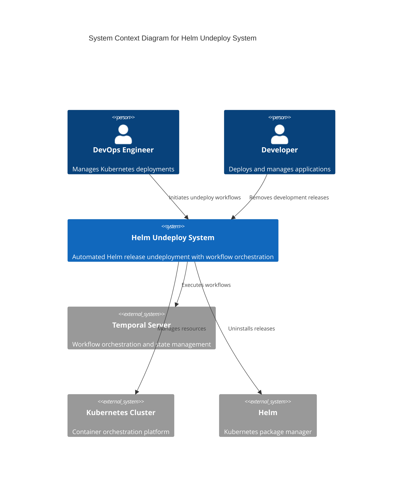
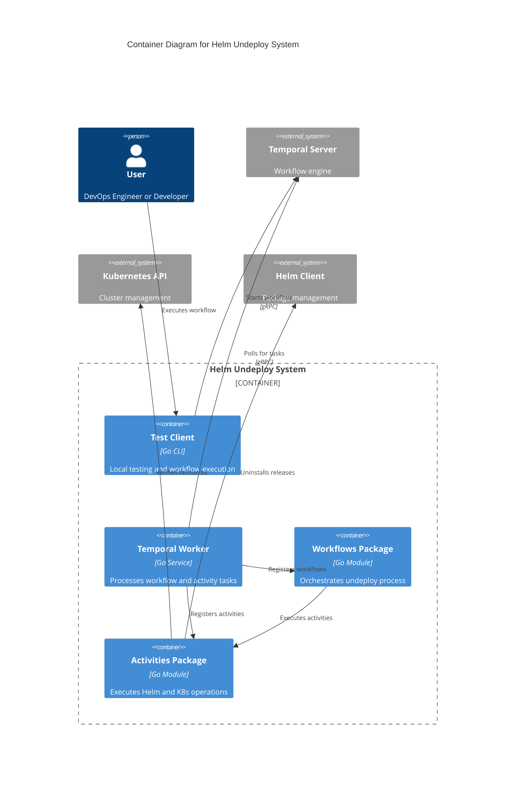
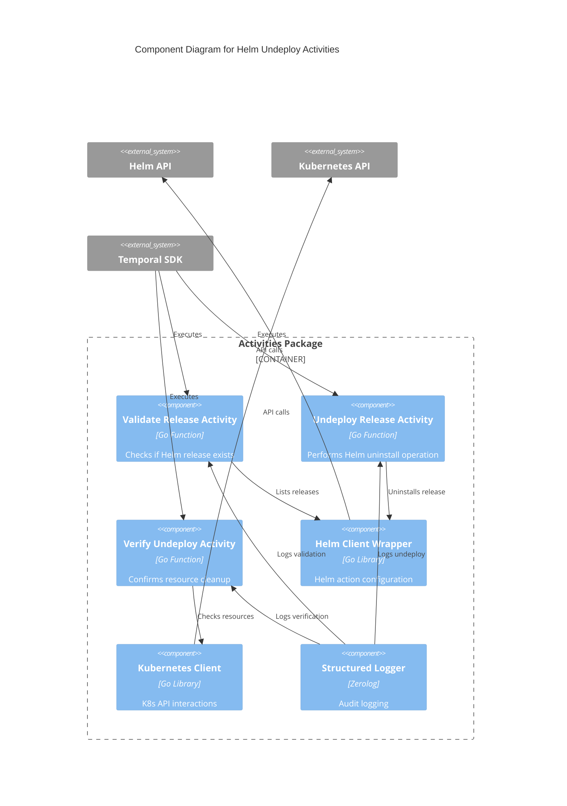
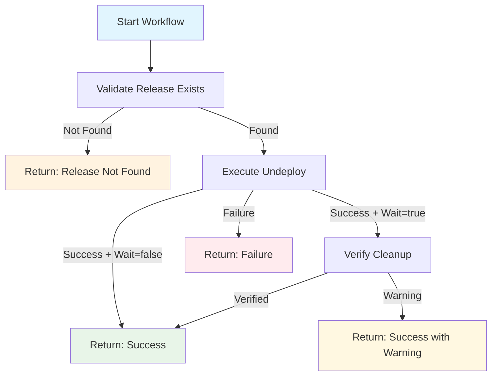

# Helm Undeploy Temporal Workflow

A robust, production-ready Go-based Temporal workflow for safely undeploying Helm-installed services from Kubernetes namespaces. This solution provides automated, reliable, and auditable Helm release removal with comprehensive verification and error handling.

## 🏗️ Architecture Overview

### C4 System Context Diagram



### C4 Container Diagram



### C4 Component Diagram



## 🚀 Features

- **🔄 Workflow Orchestration**: Built on Temporal for reliability and observability
- **✅ Pre-validation**: Verifies Helm release existence before undeploy
- **🛡️ Safe Undeployment**: Graceful resource removal with timeout controls
- **🔍 Post-verification**: Confirms complete resource cleanup
- **📊 Structured Logging**: Comprehensive audit trail with zerolog
- **🔧 Flexible Configuration**: Environment variables and secret file support
- **🧪 E2E Testing**: Automated testing with k3d and real Helm charts
- **♻️ Retry Logic**: Configurable retry policies for resilient operations
- **🐳 Cloud-Native**: Designed for Kubernetes environments

## 📁 Project Structure

```
helm-undeploy/
├── workflows/
│   └── workflow.go          # Temporal workflow definition
├── activities/
│   └── activities.go        # Activity implementations
├── worker/
│   └── main.go             # Temporal worker service
├── test/
│   └── main.go             # Local testing client
├── test-helm-chart/        # Test Helm chart for E2E testing
├── e2e-test.sh            # Automated E2E test script
├── E2E_TESTING.md         # Testing documentation
├── .env.example           # Environment configuration template
├── .gitignore             # Git ignore rules
└── go.mod                 # Go module definition
```

## 🛠️ Prerequisites

### Required Tools

```bash
# Go 1.21+
brew install go

# Temporal (for local development)
brew install temporal
brew services start temporal

# k3d (lightweight Kubernetes)
brew install k3d

# Helm
brew install helm

# GitHub CLI (optional, for repository creation)
brew install gh
```

### Environment Setup

1. **Create environment configuration:**
   ```bash
   cp .env.example .env
   ```

2. **Configure variables in `.env`:**
   ```env
   TEMPORAL_HOST=localhost:7233
   TEMPORAL_NAMESPACE=default
   TASK_QUEUE=helm-undeploy-queue
   KUBECONFIG=/path/to/kubeconfig
   HELM_DRIVER=secrets
   ```

## 🏃‍♂️ Quick Start

### 1. Start Temporal Server
```bash
brew services start temporal
```

### 2. Run E2E Test
```bash
./e2e-test.sh
```

This automated script will:
- ✅ Verify all prerequisites
- 🔧 Create a k3d cluster
- 📦 Install a test Helm chart
- 🏃‍♂️ Start the Temporal worker
- ⚡ Execute the undeploy workflow
- ✅ Verify complete cleanup

## 🔧 Manual Usage

### Start the Worker
```bash
cd worker
go run main.go
```

### Execute Workflow
```bash
cd test
go run main.go \
  -release=my-app \
  -namespace=production \
  -wait=true \
  -timeout=5m
```

### Available CLI Flags
| Flag | Description | Default |
|------|-------------|---------|
| `-release` | Helm release name (required) | - |
| `-namespace` | Kubernetes namespace | `default` |
| `-wait` | Wait for resource deletion | `true` |
| `-timeout` | Operation timeout | `5m` |
| `-temporal-host` | Temporal server address | `localhost:7233` |
| `-task-queue` | Temporal task queue | `helm-undeploy-queue` |
| `-workflow-id` | Custom workflow ID | auto-generated |

## 🔍 Workflow Details

### Workflow Steps



### Activity Descriptions

#### 1. ValidateReleaseActivity
- **Purpose**: Verifies Helm release existence
- **Input**: Release name and namespace
- **Output**: Release status, version, last updated time
- **Timeout**: 2 minutes
- **Retries**: 3 attempts with exponential backoff

#### 2. UndeployReleaseActivity
- **Purpose**: Performs Helm uninstall operation
- **Features**: 
  - Configurable wait behavior
  - Custom timeout support
  - Graceful error handling
- **Timeout**: 10 minutes
- **Retries**: 3 attempts

#### 3. VerifyUndeployActivity
- **Purpose**: Confirms complete resource removal
- **Checks**: 
  - Deployments removed
  - Services removed
  - Other labeled resources
- **Timeout**: 5 minutes
- **Retries**: 2 attempts

## 🔐 Security & Configuration

### Environment Variables

| Variable | Description | Default |
|----------|-------------|---------|
| `TEMPORAL_HOST` | Temporal server address | `localhost:7233` |
| `TEMPORAL_NAMESPACE` | Temporal namespace | `default` |
| `TASK_QUEUE` | Task queue name | `helm-undeploy-queue` |
| `KUBECONFIG` | Kubeconfig file path | `~/.kube/config` |
| `KUBECONFIG_SECRET_PATH` | K8s secret mount path | - |
| `HELM_DRIVER` | Helm storage driver | `secrets` |

### Kubernetes Secrets

For production deployments, mount secrets as files:

```yaml
apiVersion: v1
kind: Secret
metadata:
  name: kubeconfig-secret
data:
  config: <base64-encoded-kubeconfig>
---
apiVersion: apps/v1
kind: Deployment
metadata:
  name: helm-undeploy-worker
spec:
  template:
    spec:
      containers:
      - name: worker
        env:
        - name: KUBECONFIG_SECRET_PATH
          value: /var/secrets/kubeconfig/config
        volumeMounts:
        - name: kubeconfig
          mountPath: /var/secrets/kubeconfig
          readOnly: true
      volumes:
      - name: kubeconfig
        secret:
          secretName: kubeconfig-secret
```

## 📊 Monitoring & Observability

### Temporal UI
Access the Temporal Web UI at: `http://localhost:8233`

Features:
- 📈 Workflow execution history
- 🔍 Activity details and logs
- 📊 Performance metrics
- 🚨 Error tracking and retry information

### Structured Logging

All operations are logged with structured data:

```json
{
  "level": "info",
  "time": "2024-01-20T10:30:00Z",
  "caller": "activities/activities.go:45",
  "msg": "Validating helm release",
  "release": "my-app",
  "namespace": "production"
}
```

### Key Metrics to Monitor

- **Workflow Success Rate**: Percentage of successful undeployments
- **Average Execution Time**: Time from start to completion
- **Activity Retry Rate**: Frequency of activity retries
- **Resource Cleanup Verification**: Post-undeploy verification success

## 🧪 Testing

### Unit Tests
```bash
go test ./...
```

### E2E Testing
```bash
./e2e-test.sh
```

### Manual Testing Steps

1. **Setup Test Environment**
   ```bash
   k3d cluster create helm-test
   helm install test-release ./test-helm-chart
   ```

2. **Run Worker**
   ```bash
   cd worker && go run main.go
   ```

3. **Execute Workflow**
   ```bash
   cd test && go run main.go -release=test-release
   ```

4. **Verify Results**
   ```bash
   helm list
   kubectl get all -l app.kubernetes.io/instance=test-release
   ```

## 🚀 Deployment

### Docker Build
```dockerfile
FROM golang:1.21-alpine AS builder
WORKDIR /app
COPY . .
RUN go mod download
RUN go build -o worker ./worker

FROM alpine:latest
RUN apk add --no-cache ca-certificates
WORKDIR /root/
COPY --from=builder /app/worker .
CMD ["./worker"]
```

### Kubernetes Deployment
```yaml
apiVersion: apps/v1
kind: Deployment
metadata:
  name: helm-undeploy-worker
spec:
  replicas: 2
  selector:
    matchLabels:
      app: helm-undeploy-worker
  template:
    metadata:
      labels:
        app: helm-undeploy-worker
    spec:
      containers:
      - name: worker
        image: helm-undeploy:latest
        env:
        - name: TEMPORAL_HOST
          value: "temporal-server:7233"
        - name: TASK_QUEUE
          value: "helm-undeploy-queue"
        resources:
          requests:
            memory: "128Mi"
            cpu: "100m"
          limits:
            memory: "256Mi"
            cpu: "200m"
```

## 🤝 Contributing

1. Fork the repository
2. Create a feature branch: `git checkout -b feature-name`
3. Make changes and add tests
4. Run the test suite: `./e2e-test.sh`
5. Commit changes: `git commit -am 'Add feature'`
6. Push to branch: `git push origin feature-name`
7. Submit a Pull Request

## 📝 License

This project is licensed under the MIT License - see the [LICENSE](LICENSE) file for details.

## 🆘 Troubleshooting

### Common Issues

**Temporal Connection Failed**
```bash
# Check if Temporal is running
brew services list | grep temporal
brew services restart temporal
```

**k3d Cluster Issues**
```bash
# Reset cluster
k3d cluster delete helm-test
k3d cluster create helm-test
```

**Permission Denied**
```bash
# Check kubeconfig permissions
chmod 600 ~/.kube/config
```

**Helm Release Not Found**
```bash
# List all releases
helm list --all-namespaces
```

### Debug Logging

Enable debug logging by setting environment variable:
```bash
export LOG_LEVEL=debug
```

---

**Built with ❤️ using Go, Temporal, and Kubernetes**